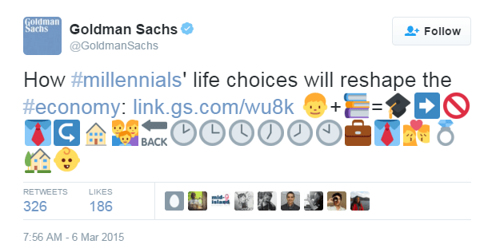
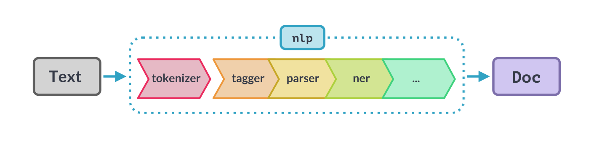

# Background
I did this project back in March 2021. I had just started with my Masters in Computer Science program and because of the
pandemic the university was online. It was a grim time as India was battling with its second and the deadliest wave of Covid.
Vaccines had recently rolled out in India and most of us were still struggling to book an appointment. But there was a 
lot of uncertainties among public regarding the vaccines as there were at least 5 different vaccines that have 
been introduced in market.


During that time, I had just started exploring the field of NLP, and was eager to put my hands on it. So I thought why 
not use the NLP to analyse the sentiments of public regarding different vaccines. I had previous experience in web scraping 
and there is no better way to learn than to apply it to a real world problem.

Now, this was at the time when Large Language Models ([ChatGPT](https://chat.openai.com)) were unheard of, and every problem was being solved using some
kind of Neural Network, but because I wanted this to be an introduction to NLP, I went with the tradition ML based NLP.

# Dataset

I don't know about you, but finding the dataset has been the most time-consuming step in my project's lifecycle. But I took a different approach with this. First things first, to perform any kind of analysis,You can search online and find some good datasets find some datasets, like this [one](https://www.kaggle.com/datasets/gpreda/all-covid19-vaccines-tweets). But, public opinion can change over time, I couldn't use an old dataset. So I decided to create my own dataset that has the most recent tweets. And to solve my problem, (I used Tweepy)[https://tweepy.readthedocs.org]. Tweepy is a python library that lets you interact with Twitter API. Tweepy can filter tweets based on location, hashtags and language of tweets. This 
feature came in handy to extract tweet from a particular region or tweets about a particular vaccine.

<!--I used the [twint](https://github.com/twintproject/twint). Twint is a beautiful libraby that lets your scrape tweets right off the hook. (You don't have to register for an api either.) 
-->

```python
    import tweepy
    #Put your Bearer Token in the parenthesis below
    client = tweepy.Client(bearer_token='Change this')

    # Get tweets that contain the hashtag #Pfizer
    # -is:retweet means I don't want retweets
    # lang:en is asking for the tweets to be in english
    query = '#Pfizer -is:retweet lang:en'
    tweets = tweepy.Paginator(client.search_recent_tweets, query=query,
                                tweet_fields=['context_annotations', 'created_at'], max_results=100).flatten(limit=1000)
```

# Data Pre-Processing

If you have ever seen a tweet, you will know that tweets are not in textbook format. Tweets generally contains slangs, abbreviations,
emojis, hashtags, shorthands, which makes the data-preprocessing a little trickier.



Take example of the above tweet. This tweet contains informal language and emojis, and if you have used Twitter before, you would know that's pretty much an average tweet looks like. But unfortunately, computer doesn't understand the meaning of emojis and slang. Now looking at tweets, one choice of processing would be to delete these abbreviations and emojis but that would change the sentiment of tweet altogether. Like this, every data processing problem is unique and the steps you take to handle data completely depends on the kind of data you have and what is your objective. For my problem I changed the emojis to their corresponding meaning and lemmatized the abbreviations. There are various libraries that exist to  achieve this task, or you can make your own functions. Something like this one. :- 
```python
def decontracted(phrase):
    # specific
    phrase = re.sub(r"won\'t", "will not", phrase)
    phrase = re.sub(r"can\'t", "can not", phrase)
    phrase = re.sub(r"cant", "can not", phrase)
    phrase = re.sub(r"y'all", "you all", phrase)
    # general
    phrase = re.sub(r"n\'t", " not", phrase)
    phrase = re.sub(r"\'re", " are", phrase)
    phrase = re.sub(r"\'s", " is", phrase)   #Using regular expressions to expand the contractions
    phrase = re.sub(r"\'d", " would", phrase)
    phrase = re.sub(r"\'ll", " will", phrase)
    phrase = re.sub(r"\'t", " not", phrase)
    phrase = re.sub(r"\'ve", " have", phrase)
    phrase = re.sub(r"\'m", " am", phrase)
    phrase = re.sub(r"\'scuse", " excuse ", phrase)

return phrase
```
The functions takes a phrase and replaces common abbreviations into proper english. 
You can find the complete Jupyter notebook (here)[https://github.com/Bhuwandutt/].

## spaCy

---

To make things simpler and organized for me, I used [spaCy](https://spacy.io). spacY is a python library that is built for Natural Language Processing. I will use spaCy to create  data preparation [pipeline](https://spacy.io/usage/processing-pipelines). An example of an NLP pipeline can be :- 




We are going to create our own pipleine to prepare our data  that needs to be fed to our Machine Learning algorithm. 

```python

import spacy

nlp = spacy.load('en_core_web_sm')
stop_words = spacy.lang.en.stop_words.STOP_WORDS
df['tweet']=df['tweet'].apply(p.clean)

# Load English parser
parser = English()

# Creating our tokenizer function
def spacy_tokenizer(sentence):
    
    # Creating our token object, which is used to create documents with linguistic annotations.
    mytokens = parser(sentence)
    
    # Lemmatizing each token and converting each token into lowercase
    mytokens = [ word.lemma_.lower().strip() if word.lemma_ != "-PRON-" else word.lower_ for word in nlp(str(mytokens))]
    
    # Removing stop words
    mytokens = [ word for word in mytokens if word not in stop_words and word not in punctuations ]

    # return preprocessed list of tokens
    return mytokens

```

# The Machine Learning

As the title suggests, this where the "magic" happens. Though these machine learning algorithms have been shadowed by the GPT-3 and BERT but these algorithms are essential to learn to for a beginner to understand how math can make a machine learn patterns and predict very accurate outcomes.  

For my project I used [Naive Bayes](https://www.youtube.com/watch?v=O2L2Uv9pdDA), [Random Forest](https://www.youtube.com/watch?v=J4Wdy0Wc_xQ),[Support Vector Machine](https://www.youtube.com/watch?v=efR1C6CvhmE). If you don't have a background in Machine Learning  and/or suffer from mathematical anxiety, libraries like sci-kit lets you use these algorithms in your python notebook by adding a few lines of [code](https://scikit-learn.org/stable/supervised_learning.html).

```python
    from sklearn import metrics
    from sklearn.pipeline import Pipeline
    from sklearn.linear_model import LogisticRegression
    
    tfidf = TfidfVectorizer(tokenizer = spacy_tokenizer)
    
    LR_classifier = LogisticRegression( max_iter=10000)
   
    # model generation
    LR_classifier.fit(X_train,y_train)
    predicted = = LR_classifier.predict(X_test)
    print('Logistic Regression with BOW',metrics.accuracy_score(y_test, predicted))
```
Full project can be found on [here](https://github.com/BhuwanDutt/)

Now, all these models comes under Supervised learning. But what is [Supervised learning](https://www.datacamp.com/blog/supervised-machine-learning) you may ask. Simply put, it's to teach Machine the correct answer by giving it a few exmaples for which we already know the label for. The already labelled data is called trained data. 
But the data we fetched from the twitter doens't have the sentiment label attached to it. So to train our dataset,I  will use this dataet which contains #xx labelled tweets.
    
<!---
#### Bias and Variance

In machine learning, we often train models to make predictions or decisions based on data. Bias and variance are two important concepts that help us understand how well our model performs.

Bias refers to the error that occurs due to the simplifying assumptions made by the model. 
A model with high bias tends to be too simple, making strong assumptions that may not be realistic. For example, if we  have a linear regression model to predict housing prices but the model assumes that the relationship between 
the features and the price is always a straight line, it might struggle to capture more complex patterns, leading to high bias.

Variance, on the other hand, refers to the amount that the predictions of a model vary for different training sets. 
It measures the model's sensitivity to the specific data points it's trained on. A model with high variance is overly 
complex and can "overfit" the training data. This leads to poor performance when the model encounters new, unseen data.
To achieve good predictive performance, we aim to strike a balance between bias and variance. 
This is known as the bias-variance tradeoff.
We want our model to have enough complexity to capture the underlying patterns in the data (low bias) while avoiding
over-fitting and maintaining generalizability (low variance).
Understanding bias and variance allows us to diagnose and address issues with our models.
--->

# References

Josh Starmer : [Naive Bayes](https://www.youtube.com/watch?v=O2L2Uv9pdDA), [Random Forest](https://www.youtube.com/watch?v=J4Wdy0Wc_xQ)